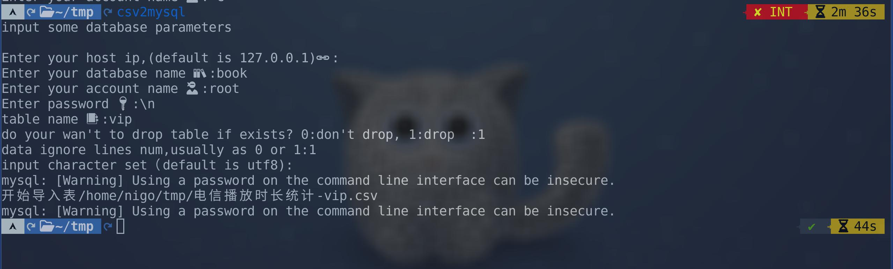

# import-csv-to-mysql

批量导入csv文件或者txt文件到mysql数据库。

[视频介绍](https://www.bilibili.com/video/BV1HS4y1m748/) 

## 如何安装

克隆本项目：
```bash
git clone https://github.com/nigo81/import-csv-to-mysql.git
```

给`csv2mysql`文件添加可执行权限：

```bash
chmod +x csv2mysql
```

将`csv2mysql`复制到`~/.local/bin`:

```bash
cp csv2mysql ~/.local/bin
```

你需要安装`fzf`搜索工具，因为脚本里调用它来选择文件。

## 如何使用

进入你csv文件所在目录，然后执行`csv2mysql`


你可以使用`fzf`的搜索功能，按下`tab`键可以选中文件。

选择完成后，按下回车确认。



```bash
    ~/tmp  csv2mysql
input some database parameters

Enter your host ip,(default is 127.0.0.1)🔗:
Enter your database name 📚:book
Enter your account name 🥷:root
Enter password 🔑:\n
table name 📑:vip
do your wan't to drop table if exists? 0:don't drop, 1:drop  :1
data ignore lines num,usually as 0 or 1:1
input character set（default is utf8):
```
你需要填写mysql数据库的一些信息，如ip,数据库名称，账号，密码。

你需要在`table name`处输入你将导入的数据保存的表的名称，如果数据库中没有该表，会自动创建。


## vim脚本

如果你熟悉vim，我也写了个vim脚本。

```
" SQL建表 可以将一行表头转换为导入语句
vnoremap <F12> :call Mysql()<CR>
func! Mysql() range
let line = getline('.')
let l = line('.')
let start = l
let word_list = split(line,',')
let output = ["create table <++> ("]
let i =0
for word in word_list
    let word = substitute(word,'^"','','')
    let word = substitute(word,'"$','','')
    let word = "`" . word . "`"
    let i=i+1
    if i == len(word_list)
        call add(output,word . " varchar(255)")
    else
        call add(output,word . " varchar(255),")

    endif
    let l = l+1
endfor
call add(output,");")
call append(start,output)
let l = l+3
call setline(l ,"")
call setline(l+1 ,"load data infile <++>")
call setline(l+2,"into table <++>")
call setline(l+3,"character set 'utf8'")
call setline(l+4,"fields terminated by '<++>' optionally enclosed by <++>")
call setline(l+5,"lines terminated by '<++>' ignore 1 lines;")
"return line
endfunc
```

可视模式下选中表头行，按下F12键，就可以自动生成建表语句和导入语句。
